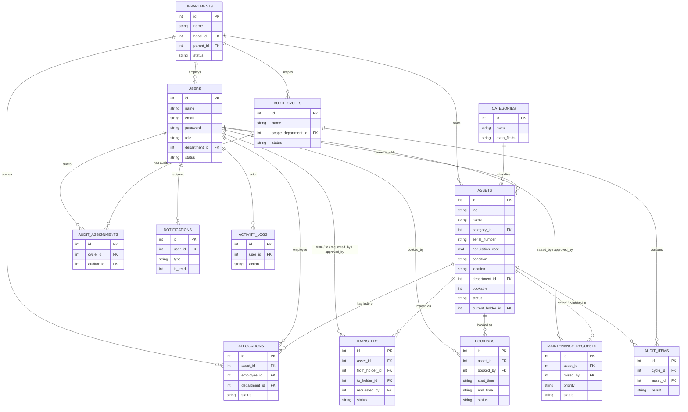

# AssetFlow — Entity Relationship Diagram

Paste the block above into [mermaid.live](https://mermaid.live) or any Markdown viewer with Mermaid support (GitHub renders it natively) to view it visually.
